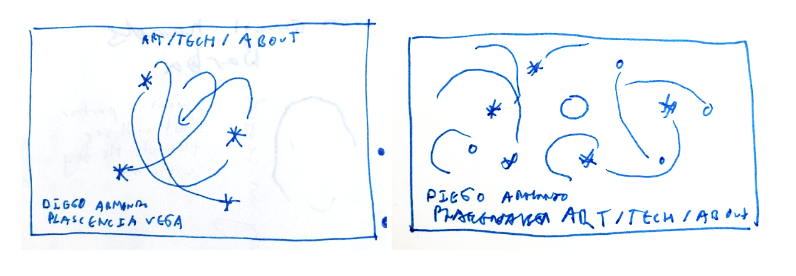

# Objective
The objective of this project is to update my personal website that displays the different art and technology projects I have done over the years.

## Issues to solve

### Technical issues
* Currently the website is not mobile friendly
* The website is hand-crafted. Every time I want to add a new item to the website, I need to go in and change the HTML code directly.

### Design issues
* The front page is currently "blank" with just a slowly shifting gradient. I would like to add an animation or interactive element.
* Technical and Art projects should be in time order. It is hard for viewers to know what the latest projects are

## Scope
* **In scope**: Front page redesign with animation, content management system, mobile responsiveness
* **Out of scope**: Gallery page redesign (keep current style, focus on front page)
* **Target browsers**: Modern browsers only (latest Chrome, Firefox, Safari, Edge)

# Website Design
I propose a design that is as follows.

The front page of the website will display a **three-body problem simulation** — three points of light tracing periodic solutions of the Newtonian gravitational three-body problem on an HTML Canvas. Each time the page is loaded (or refreshed), the simulation randomly selects one of three classical periodic solution families:

1. **Lagrange (equilateral triangle)** — three equal masses maintain an equilateral triangle as they orbit their common center of mass
2. **Euler (collinear)** — three masses remain collinear, oscillating along a line through the center of mass
3. **Figure-eight choreography** — three equal masses chase each other around a figure-eight shaped curve (discovered numerically by Moore, proved by Chenciner & Montgomery)

The simulation uses real-time Newtonian gravity integration (4th-order Runge-Kutta) to evolve the positions of the three bodies each frame. Each body is rendered as a glowing point of light in a **warm palette** (gold, orange, red-orange), with a fading luminous trail behind it that visualizes the orbital path. The trails gradually fade to transparent, creating an elegant visual of the motion history.

The three bodies are purely visual/decorative — they do not link to projects. All project navigation happens through the menu.



* The __background__ gradient colors functionality will remain as-is for now. These colors may be tuned later.
* The __three bodies__ are rendered as glowing points with warm colors (gold, orange, red-orange). Their brightness/opacity adjusts with the background to remain visible. These colors may be tuned later so it should be easy to do so.
* Each body leaves a __fading trail__ of light in its assigned color, showing its recent orbital path. Trails fade to transparent over a configurable number of past positions.
* **Artist name on mobile**: The name "DIEGO ARMANDO PLASCENCIA VEGA" must always display stacked as two lines (`DIEGO ARMANDO` / `PLASCENCIA VEGA`), matching the desktop layout. On mobile the name container is constrained to a `max-width` that forces this wrap.
* The old jQuery UI accordion sidebar navigation has been removed and replaced with a simple top navigation menu:

                                {CATEGORY_1} / {CATEGORY_2} / ... / ABOUT

    * The menu is generated dynamically from the category folder names under `/projects/`, plus a fixed ABOUT link. No categories are hard-coded.
    * The menu will be displayed on the top right of the page
    * Clicking the about page will simply transition you to the "about" page with information about me (similar to the current about page)
    * The menu displays simple links to dedicated **category gallery pages** (one per category, e.g. `gallery_art.html`, `gallery_tech.html`). Each gallery page shows all projects in that category as a responsive thumbnail grid sorted chronologically.

## Accessibility
* The dynamically generated category menu (plus ABOUT) will always be visible and fully keyboard-navigable
* Menu items will have proper focus states and ARIA labels for screen readers
* Users who cannot see the animation can still navigate the site via the menu


# Technical Approach

## Site Generation
I would like to build the structure of this website once, and then be able to add/remove/reorganize content easily without restructuring it. The approach we can take is to set up a file structure (similarly to what exists now) which includes images and markdown files and then auto-generate the website by running a **custom Python script**.

### File Structure
Categories are not hard-coded. Any subfolder of `/projects/` is treated as a category (e.g. `art`, `tech`, or anything added in the future). The generator script discovers categories dynamically by scanning folder names.

```
/projects
├── /{category_1}
│   └── /project_name
│       ├── project.md
│       ├── thumbnail.png
│       ├── image1.png
│       └── image2.png
└── /{category_2}
    └── /project_name
        ├── project.md
        ├── thumbnail.png
        ├── image1.png
        └── image2.png
```

### Project Metadata
Each `project.md` file will contain YAML frontmatter with the following fields:
```yaml
---
title: "Project Title"
date: 2024-10-08
description: "A brief description of the project"
thumbnail: "thumbnail.png"
images:
  - file: "image1.png"
    thumb: "image1_thumb.png"
    title: "Display Title"
    caption: "Caption text"
  - file: "image2.png"
    thumb: "image2_thumb.png"
    title: "Another Image"
    caption: "Another caption"
---

Full project description in markdown...
```

- `date`: Year (or full date) used for chronological sorting in galleries
- `images`: Array of gallery images, each with `file` (full-size), `thumb` (thumbnail), `title`, and `caption`

Adding content should be as easy as adding some files to the file structure, running the Python script, opening a PR, reviewing and pushing (without changing the core code). Adding a new *category* is equally simple: create a new folder under `/projects/` and the generator and front-end will pick it up automatically.

## Front-end Animation: Three-Body Problem Simulation
* **Technology**: HTML Canvas for rendering the simulation
* **Physics engine**: Real-time Newtonian gravity integration using 4th-order Runge-Kutta (RK4). Three bodies with mutual gravitational attraction (O(n²) = O(9) force calculations per step — trivial for 3 bodies).
* **Initial conditions**: Stored in `js/three_body_sim.js` as part of the simulation module. Five orbit configurations (masses may be equal or unequal depending on the orbit; choreographies require equal masses, others do not):
    1. Figure-eight choreography (Moore/Chenciner-Montgomery)
    2. Moth I choreography (Šuvakov & Dmitrašinović, 2013)
    3. Moth II choreography (Šuvakov & Dmitrašinović, 2013)
    4. Hierarchical triple (tight binary + wide outer orbit)
    5. Euler collinear orbit (eccentric variant, 1.20× velocity scaling)
* **On page load**: One configuration is chosen at random, initial conditions are loaded, and the simulation begins.
* **Rendering**: Each body is drawn as a glowing circle (warm palette: gold `#FFD700`, orange `#FF8C00`, red-orange `#FF4500`). A fading trail stores the last N positions and draws them with decreasing opacity.
* **Performance**: RK4 with 3 bodies is extremely lightweight. Adaptive time-stepping or fixed small dt ensures stability for the periodic orbits.

# Execution Plan
The creation of the new website should happen in the following steps, stopping at each to test the new functionality manually and adding a commit at each step of the way.

## Phase 1: Content Management System ✅
- [x] Design and create the `/projects` file structure with sample projects
- [x] Create project.md template with YAML frontmatter (title, date, description, thumbnail)
- [x] Build Python script to parse project files and generate site data (JSON)
- [x] Integrate generated data with existing HTML templates
- [x] Test: Add/remove a project and regenerate site
- [x] Migrate all 11 projects (8 art, 3 tech) to markdown + colocated images
- [x] Remove hard-coded categories — generator discovers categories dynamically from folder names

## Phase 2: Mobile Responsiveness ✅
- [x] Audit current CSS for mobile breakpoints
- [x] Add viewport meta tag to template and standalone pages (about.html, index.html)
- [x] Implement responsive media queries (≤768px breakpoint) for menu, content, galleria, about page
- [x] Test on iPhone and various screen sizes (manual testing needed)

## Phase 2b: Mobile Navigation Improvements
- [x] Fix artist name stacking: constrain `#ARTIST_NAME` `max-width` in the mobile media query so "DIEGO ARMANDO / PLASCENCIA VEGA" always wraps to two lines
- [x] Create a `gallery` HTML template for category gallery pages (responsive thumbnail grid, sorted by date)
- [x] Update `generate_site.py` to generate one gallery page per category (e.g. `gallery_art.html`, `gallery_tech.html`)
- [x] Test gallery pages on mobile and desktop

## Phase 3: Front Page Animation — Three-Body Problem Simulation
Build in layers, testing each before moving to the next:

### Phase 3a: Physics Engine ✅
- [x] Create `js/three_body_sim.js` with RK4 integrator for Newtonian 3-body gravity
- [x] Define initial conditions data for three periodic solution families (figure-eight, Moth I, Euler) — Lagrange replaced with Moth I (Šuvakov & Dmitrašinović) because the equal-mass Lagrange equilateral orbit is linearly unstable
- [x] Verify each set of initial conditions produces a stable periodic orbit (Python verification + standalone `test_three_body.html`)

### Phase 3b: Canvas Rendering & Background ✅
- [x] Set up full-viewport HTML Canvas on the front page, replacing the CSS background gradient
- [x] Render the shifting background gradient directly on the canvas (same colors as current CSS, kept in easily tunable config variables)
- [x] Render three bodies as glowing circles with warm palette (gold, orange, red-orange)
- [x] Implement fading trail effect: store recent positions, draw with decreasing opacity
- [x] Add glow/bloom effect to the points of light (radial gradient or shadow blur)

### Phase 3c: Integration & Polish ✅
- [x] On page load, randomly select one of the three periodic solution families
- [x] Connect physics engine output to canvas renderer in a requestAnimationFrame loop
- [x] Adjust body/trail brightness based on background gradient phase (lighter on dark, darker on light)
- [x] Handle canvas resize on window resize and orientation change
- [x] Test performance on mobile devices
- [x] Tune simulation speed, trail length, glow intensity for visual appeal
- [x] Deprecate `main.html`: remove from generator standalone pages list, delete template and generated file, update any links pointing to it
- [x] Clean up any remaining accordion artifacts (stale generated HTML files with old accordion code — regenerate to fix)
- [x] Remove `epicycles_article.html` (stale hand-crafted file; article content has been migrated to the GitHub repo and linked from the project description)

## Phase 4: Final Tuning & Testing ✅
- [x] Tune body colors, trail colors, glow intensity, and background gradient palette
- [x] Tune simulation speed and trail length for visual appeal
- [x] Cross-browser testing (Chrome, Firefox, Safari, Edge)
- [x] Mobile device testing (iOS Safari, Android Chrome)
- [x] Remove unused legacy files (jQuery UI directory already removed in 3c; check for other old assets)
- [x] Final review of all generated pages for consistency


# References
* https://en.wikipedia.org/wiki/Three-body_problem
* https://en.wikipedia.org/wiki/Central_configuration
